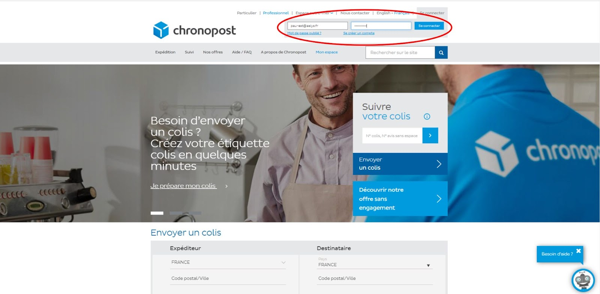
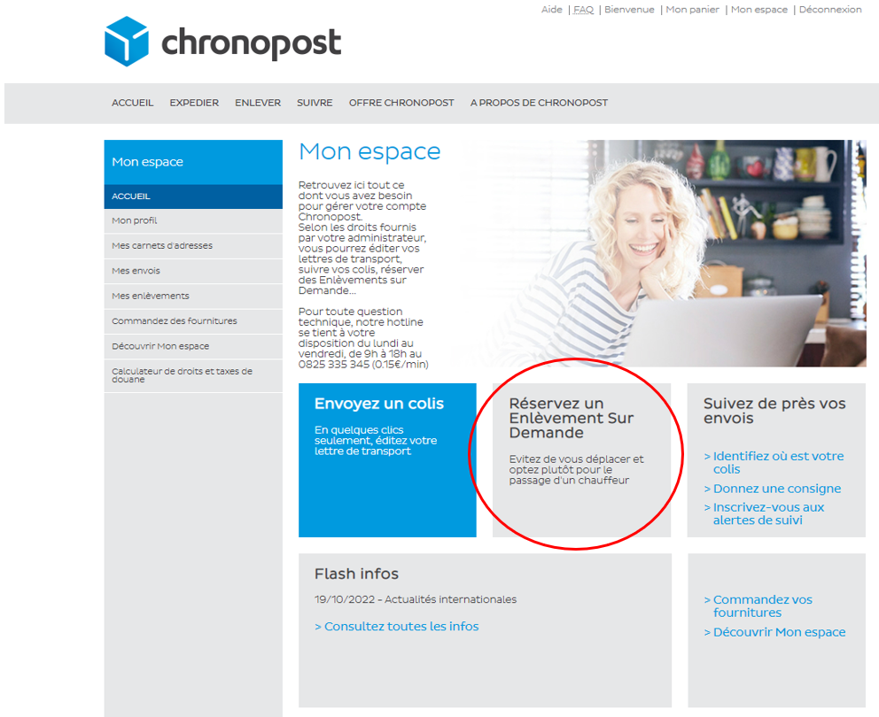
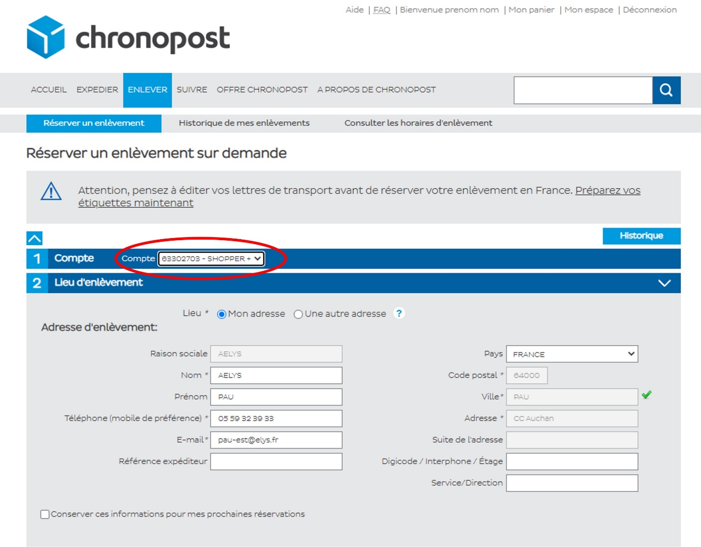
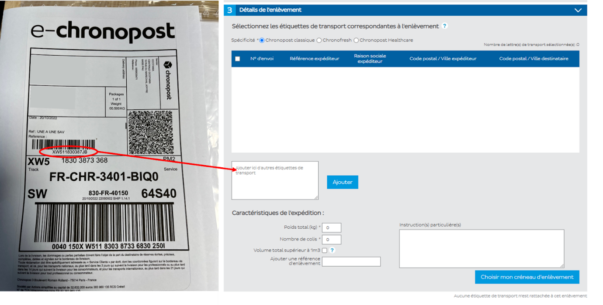
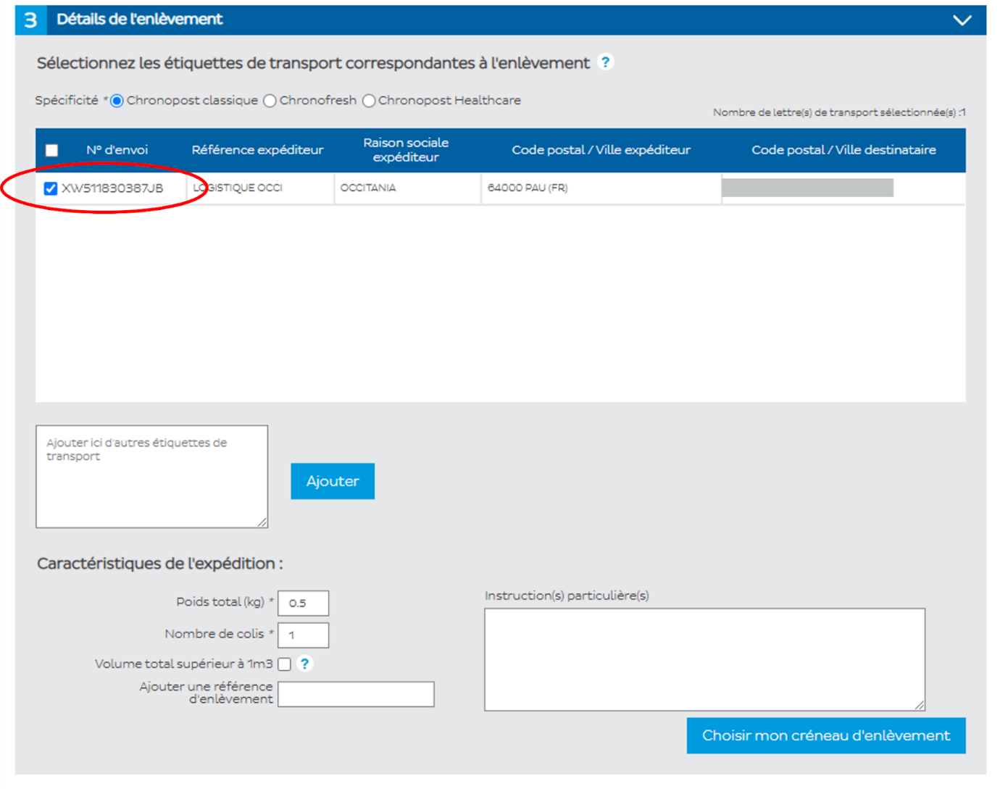
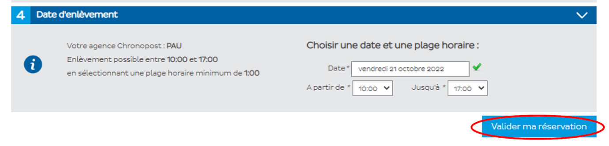

# Commandes web — Demande de collecte Chronopost

**Service :** WEB – MARKETING | **Mis à jour :** 15/11/2022
**Concerne :** Aélys (OCC) uniquement

**Objectif :** Effectuer une demande de collecte Chronopost pas à pas.

Lorsqu'un client commande un produit en livraison **express**, une demande de collecte doit être effectuée sur : **https://www.chronopost.fr/fr/professionnel#/step-home**

---

## Étapes

### Étape 1 — S'identifier sur le site

Utilisez les identifiants du tableau ANNEXE 1 en bas de cette procédure.

### Étape 2 — Faire une demande d'enlèvement

### Étape 3 — Sélectionner Shopper+

### Étape 4 — Entrer le numéro du Chronopost et cliquer sur Ajouter

### Étape 5 — Sélectionner les étiquettes ajoutées

### Étape 6 — Choisir le créneau et valider

> ✅ Choisissez le **créneau le plus rapide** proposé automatiquement par Chronopost afin de répondre rapidement à la demande de livraison du client.

---

## ANNEXE 1 — Identifiants Chronopost par magasin

| Magasin | Identifiant / Email | Mot de passe |
|---|---|---|
| 200 | pau-est@aelys.fr | Aelys2022! |
| 201 | montauban-sud@aelys.fr | Aelys2022! |
| 300 | montauban-nord@aelys.fr | Aelys2022! |
| 301 | pau@aelys.fr | Chronopost2022! |
| 302 | castres@aelys.fr | Aelys2022! |
| 303 | st-andre@aelys.fr | Aelys2022! |
| 304 | marsac@aelys.fr | Aelys2022! |
| 305 | ibos@aelys.fr | Aelys2022! |
| 306 | boe@aelys.fr | Aelys2022! |
| 309 | bouliac@aelys.fr | Aelys2022! |
| 310 | lescar@aelys.fr | Lescar310! |
| 312 | dax@aelys.fr | Aelys2022! |
| 313 | lepian@aelys.fr | Aelys2022! |

---

📄 *Source : Demande de collecte Chronopost — Service WEB/MARKETING*
