# Commandes web — Constitution d'une commande en lettre suivie

**Service :** WEB – MARKETING | **Mis à jour :** 15/11/2022
**Concerne :** Aélys (OCC) uniquement

**Objectif :** Préparer un envoi en lettre suivie.

> 🎥 **Vidéo disponible :** « Process envoi lettre » sur [Google Drive](https://drive.google.com/drive/folders/1gXcxbPw2DVol8WWswaKbozKo-h82i2Wm)

> ⚠️ **Vérifiez que le Bon de Livraison correspond aux articles de la commande : 1 produit = 1 ligne.**
> Si vous constatez une erreur, contactez le service web au **05 64 27 10 37**.

---

## Contenu de l'envoi

Une commande en lettre suivie doit contenir :
- L'**enveloppe bulles**
- Le produit inséré dans un **écrin web** (écrins spécifiques commandes web — pas les écrins magasin)
- Le **livret « Merci pour votre commande »**
- Le **porte-document** contenant le bon de livraison
- *(Optionnel)* Une **pochette Aélys** si la commande inclut l'option emballage cadeau

---

## Étape par étape

### Étape 1 — Mettre le produit dans l'écrin web

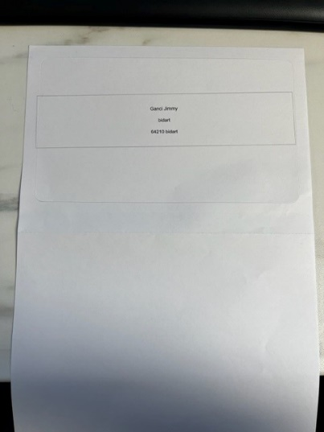
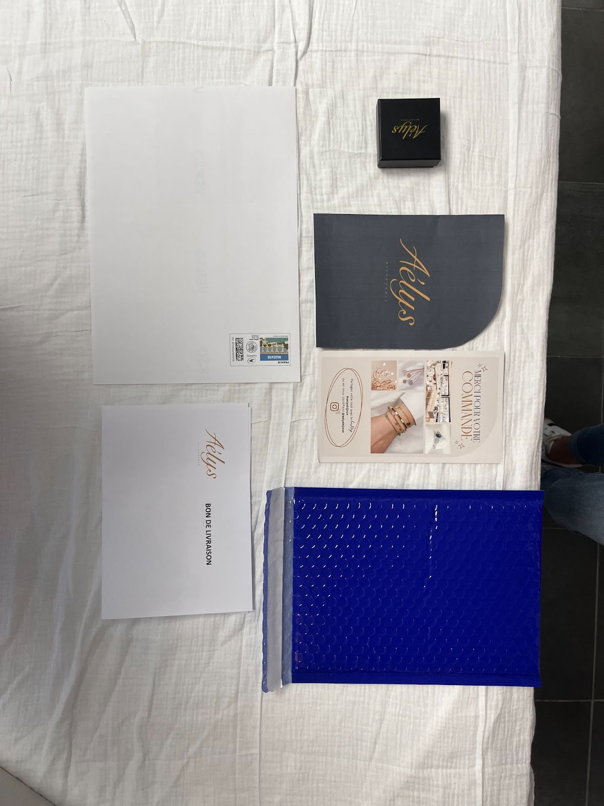

### Étape 2 — Insérer le bon de livraison dans le porte-document

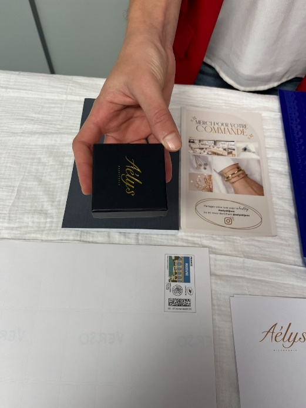

### Étape 3 — Insérer l'écrin, le porte-facture et le livret dans l'enveloppe

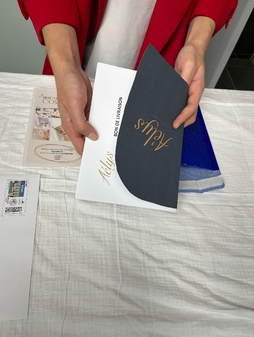

### Étape 4 — Apposer le timbre sur l'enveloppe

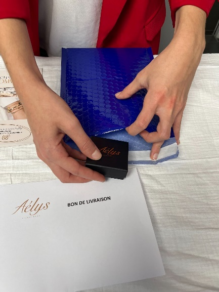
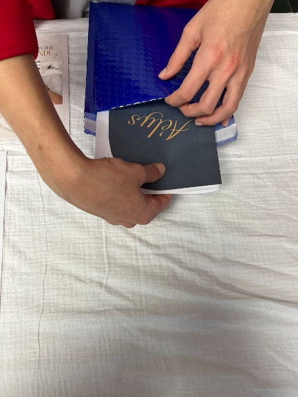
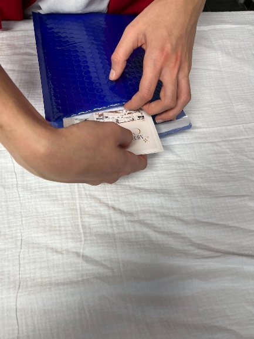

### Étape 5 — Découper l'étiquette et la coller sur l'enveloppe

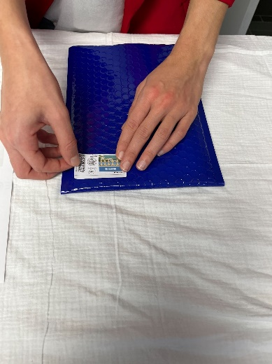

### Étape 6 — Votre enveloppe est prête !

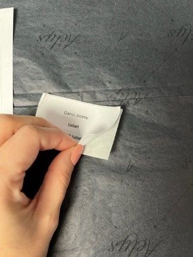
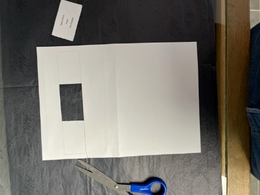
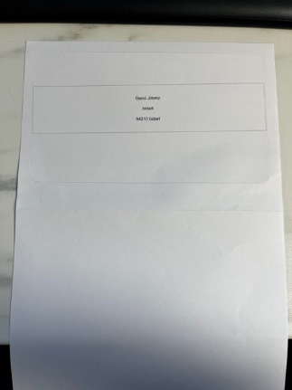

### Étape 7 — Déposer dans la boîte aux lettres du centre commercial

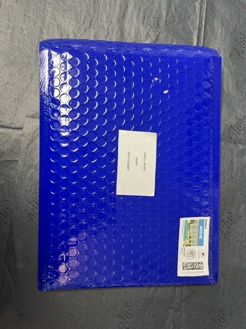

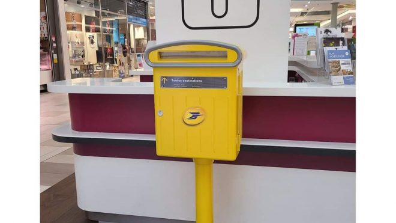

---

📄 *Source : Constitution d'une commande lettre suivie — Service WEB/MARKETING*
