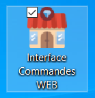
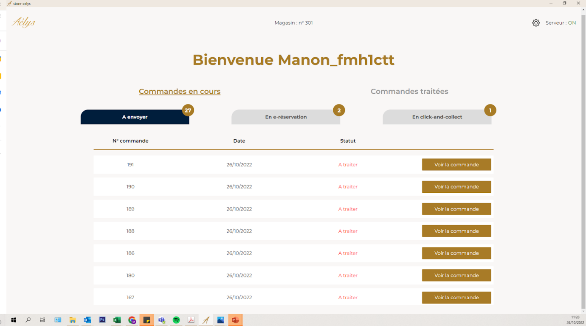
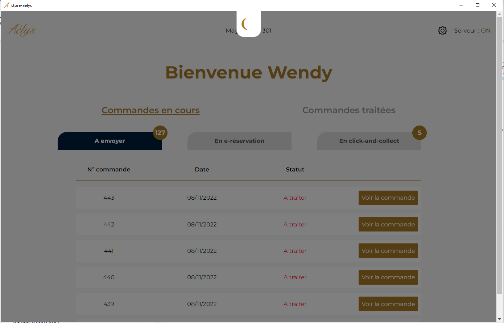
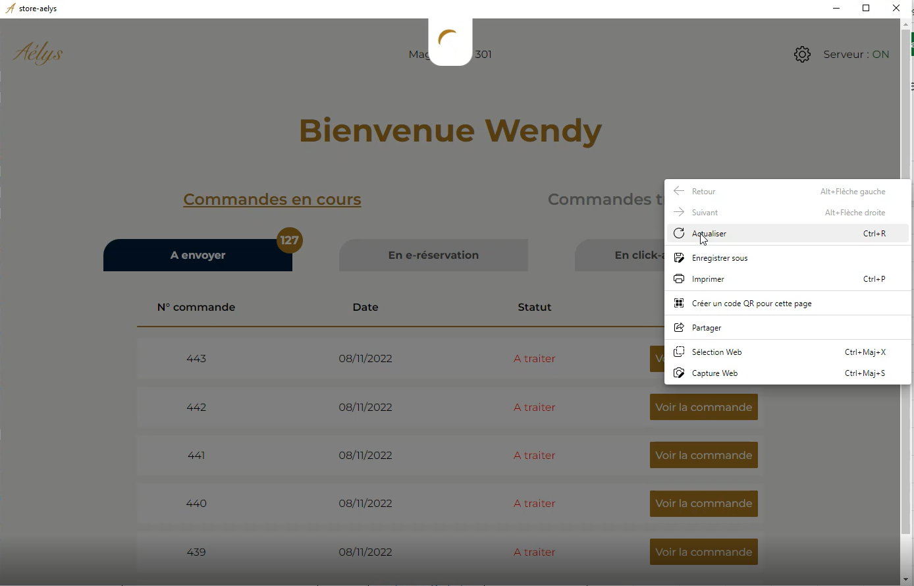
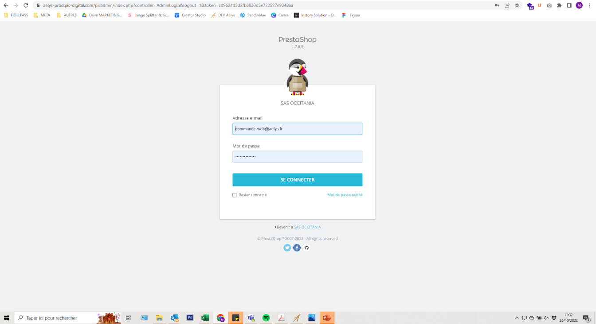
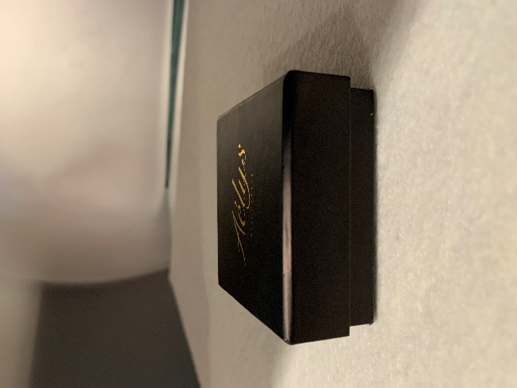
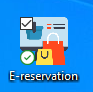

# Commandes web — Fonctionnement général

**Service :** WEB – MARKETING | **Mis à jour :** 12/12/2022
**Concerne :** Aélys (OCC) et Franchisés Aélys (CGE)

**Objectif :** Comprendre le fonctionnement global des commandes web et avoir une vue d'ensemble sur le sujet.

---

## 1. Présentation générale du traitement des commandes web

Le stock des produits sur le site web est directement relié au stock de la centrale et des magasins. Cela permet de proposer davantage de marques et de produits, et d'avoir une profondeur de stock plus importante.

Lorsqu'une commande est validée par un client, l'article est recherché sur le stock de la centrale et de l'ensemble des magasins — **chaque magasin doit donc pouvoir préparer la commande et l'expédier**.

> **Objectif à terme :** 80% des commandes web expédiées depuis la centrale et le magasin 301 (Pau Centre).

> ⚠️ **Important :** La mise à jour des stocks sur le site n'est **pas en temps réel**. ODEIS envoie l'information des stocks de chaque magasin **3 fois par jour** vers le site web. La remontée des stocks ne se faisant pas en temps réel, il faut toujours **vérifier que le produit est encore présent** avant de confirmer l'envoi.

---

### 1.1 Commande avec 1 seul article

Lorsqu'un seul produit est commandé, le site interroge les magasins **un par un dans un ordre déterminé**. Si le premier magasin dispose du produit, une alerte lui est envoyée.

> ⚠️ Tant que le premier magasin n'a pas validé un des deux choix, la commande reste en attente. **Il est impératif de traiter rapidement les commandes entrantes.**

Le magasin qui reçoit l'alerte a deux choix :

1. **Accepter** l'envoi et préparer la commande
2. **Refuser** l'envoi

**Les seules raisons valables pour refuser :**
- Le produit a été vendu entre temps (décalage dû à la mise à jour des stocks non temps réel)
- La référence est manquante dans le magasin (erreur d'inventaire)

Si le magasin refuse, le site interroge le magasin suivant sur la liste (même deux choix : accepter ou refuser). Cette mécanique se reproduit **en cascade** jusqu'à ce qu'un magasin accepte.

---

### 1.2 Commande avec plusieurs articles

Si le client commande plusieurs articles, le site envoie en priorité la commande au magasin disposant de **tous les produits**.

Le magasin peut accepter ou refuser **chaque article individuellement** (une ligne = un produit).

**Exemple :** une commande arrive au magasin 200 avec 2 produits.
- Le magasin dispose des 2 articles → il valide l'envoi des 2 articles.
- Le magasin dispose d'1 article sur 2 → il accepte celui qu'il a et refuse l'autre → il prépare et expédie le colis avec 1 seul article. Le magasin suivant reçoit une alerte pour l'article refusé.

> Le client reçoit sa commande en **deux colis distincts**, mais ne paie qu'une seule fois la livraison — nous prenons la 2ème livraison à nos frais.

---

## 2. L'interface de gestion des commandes

### 2.1 Application sur le bureau (PC magasin)

Une application a été installée sur chaque PC de chaque magasin pour gérer les commandes web. **Elle doit rester ouverte et active en permanence.**

> ✅ **Chaque matin : vérifiez que l'interface est bien ouverte sur chaque PC.**

Lorsqu'une commande arrive, vous recevez un pop-up *« Vous avez X commandes en attente »* :

Vous pouvez fermer cette fenêtre et retrouver la commande sur le tableau de bord.

**Le tableau de bord affiche :**

Les commandes en cours à traiter, réparties en 3 onglets :

| Onglet | Signification |
|---|---|
| **À envoyer** | Le client a passé commande avec livraison à domicile ou en point relais |
| **En e-réservation** | Le client a réservé un produit et souhaite venir l'essayer et régler en magasin |
| **En click-and-collect** | Le client a payé sa commande sur le site et vient la récupérer en magasin |

Dans chaque onglet, vous trouvez également :
- Le numéro de commande
- La date à laquelle la commande a été passée
- Le statut de la commande
- Un bouton **« Voir la commande »** pour la traiter

La fenêtre s'actualise toutes les 5 minutes. Vous verrez l'application charger avec une petite animation :

Si la fenêtre charge en continu sans s'arrêter, faites un **clic droit → Actualiser** :

---

### 2.2 Interface web (pour traiter la commande)

En cliquant sur **« Voir la commande »**, une page web s'ouvre.

- Les identifiants sont normalement pré-enregistrés → cliquez simplement sur **Se connecter**.
- Cochez **« Rester connecté »** pour ne pas avoir à ressaisir les identifiants.

**Identifiants par magasin :**

| Numéro mag | E-mail | Mot de passe Interface |
|---|---|---|
| 200 | pau-est@aelys.fr | aelys-pau |
| 201 | montauban-sud@aelys.fr | aelys-montauban |
| 300 | montauban-nord@aelys.fr | aelys-montauban |
| 301 | pau@aelys.fr | Pau301 |
| 302 | castres@aelys.fr | aelys-castres |
| 303 | st-andre@aelys.fr | aelys-st-andre |
| 304 | marsac@aelys.fr | aelys-marsac |
| 305 | ibos@aelys.fr | aelys-ibos |
| 306 | boe@aelys.fr | Boe306 |
| 309 | bouliac@aelys.fr | aelys-bouliac |
| 310 | lescar@aelys.fr | aelys-lescar |
| 312 | dax@aelys.fr | aelys-dax |
| 313 | lepian@aelys.fr | aelys-lepian |
| 401 | reims.tinqueux@aelys.fr | aelys-tinqueux |
| 402 | nemours@aelys.fr | aelys-nemours |
| 404 | saint-avold@aelys.fr | aelys-saint-avold |
| 406 | aurillac@aelys.fr | aelys-aurillac |
| 408 | ales@aelys.fr | aelys-ales |
| 409 | villers-semeuse@aelys.fr | aelys-villers-semeuse |
| 410 | nantes@aelys.fr | aelys-nantes |
| 411 | cherbourg.glacerie@aelys.fr | aelys-cherbourg |
| 412 | villiers-en-biere@aelys.fr | aelys-villiers |
| 413 | vitrolles@aelys.fr | aelys-vitrolles |
| 414 | saint.nazaire@aelys.fr | aelys-saint-nazaire |
| 417 | amphion@aelys.fr | aelys-amphion |
| 420 | colmar@aelys.fr | aelys-colmar |
| 421 | cabries@aelys.fr | aelys-cabries |
| 422 | toulon.lavalette@aelys.fr | aelys-toulon |
| 423 | torcy@aelys.fr | aelys-torcy |

**Procédures détaillées par type de commande :**
- 📄 *Doc 1 — Gestion des commandes en livraison*
- 📄 *Doc 2 — Gestion des demandes e-réservation*
- 📄 *Doc 3 — Gestion des commandes click & collect*

---

## 3. Les formats d'envoi selon le transporteur

Plusieurs types de livraison sont proposés au client :

### Lettre suivie

Disponible uniquement pour les produits **Aélys inférieurs à 49€**. Livraison à domicile, gratuite pour le client.

- Format : enveloppe à bulles avec timbre tracé (code de suivi pour tracer la réception)
- ⚠️ Épaisseur maximale : **3 cm** — les écrins magasin classiques étant trop épais, utilisez les **écrins web** spécifiques

---

### Livraison à domicile (colis)

Le client peut choisir :
- **Colissimo standard**
- **Chronopost express**

---

### Point relais (Pick-up Colissimo)

Le client choisit son point relais dans la liste des pick-up Colissimo.

Pour les livraisons à domicile et point relais, utilisez le **format colis**. Deux tailles de cartons disponibles :

| Carton | Utilisation |
|---|---|
| **Taille standard** | Majorité des commandes — adapté à tous les écrins Aélys et à la plupart des écrins montres/bijoux |
| **Grande taille** | Uniquement pour les écrins hors-format ne rentrant pas dans la taille standard |

> ⚠️ **Ces fournitures (écrins web, enveloppes, cartons) sont exclusivement réservées aux commandes web.** Elles ne doivent pas être utilisées pour des envois en centrale.

Le format de la commande (lettre suivie ou colis) est **indiqué au moment de la préparation**.

---

### Click-and-collect

Le client règle sa commande sur le site et vient la récupérer en magasin. La préparation est identique à un achat classique en boutique : **pochette Aélys + écrin magasin standard**.

---

## 4. La e-réservation

Le client peut réserver un produit dans le magasin Aélys de son choix. C'est une **mise de côté** : le client doit se rendre en magasin **sous 48h** pour essayer l'article et régler (ou non) sur place.

> Une demande de réservation ne peut concerner qu'**1 produit à la fois**.

**Fonctionnement :**

- Si le produit est en stock → le client confirme, le magasin reçoit une alerte via l'interface
- Si le produit n'est pas en stock → le client est invité à sélectionner un autre magasin

**Lorsque la notification arrive en magasin :**

| Situation | Action |
|---|---|
| Vous avez l'article | Validez la demande → un mail est automatiquement envoyé au client pour l'inviter à venir sous 48h |
| Vous n'avez pas l'article | Refusez via l'interface + utilisez l'application **« E-Réservation »** (sur PC-2, sauf magasin 404 : PC-1) pour envoyer un mail au client et notifier la centrale |

> ⚠️ **Magasins CGE :** uniquement concernés par les commandes **click-and-collect** et **e-réservation** — pas d'envoi depuis ces magasins pour le moment.

---

📄 *Source : Fonctionnement général des commandes web — Service WEB/MARKETING*
