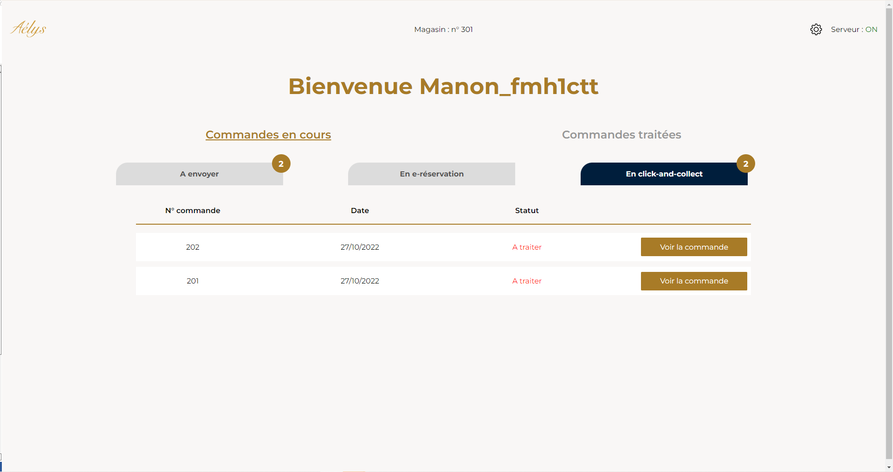
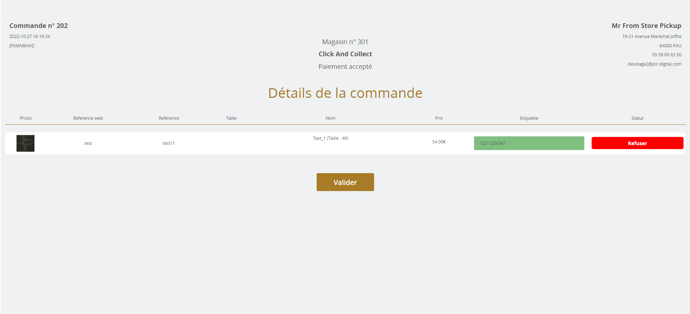
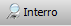
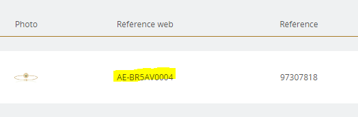
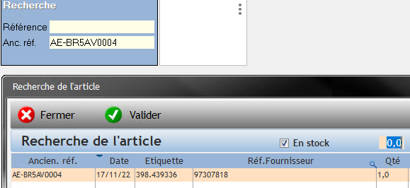

# Commandes web — Gestion d'une commande click-and-collect

**Service :** WEB – MARKETING | **Mis à jour :** 12/12/2022
**Concerne :** Aélys (OCC) et Franchisés Aélys (CGE)

**Objectif :** Préparer pas à pas une commande en click-and-collect.

---

## 1. Présentation du concept

Lors d'un click-and-collect, le client passe commande sur le site, **paie en ligne**, et se rend dans le magasin de son choix pour récupérer sa commande. Le client a **8 jours** pour venir la chercher.

---

## 2. Traitement de la commande

Les commandes click-and-collect arrivent dans l'onglet **« En click and collect »** de votre interface.

- Cliquez sur **« Voir la commande »**
- La page web s'ouvre avec le détail de la demande

**Comment vérifier si l'article est en stock ?**

Sur ODEIS, cliquez sur **Interro** :

Dans **Ancienne Référence**, indiquez la référence WEB :

Vous verrez la fiche stock : **quantité = 1** → disponible / **quantité = 0** → indisponible.

**Si vous avez l'article :**
- Sortez-le de la vitrine
- Renseignez son numéro d'étiquette dans le champ **« Étiquette »** (en vert) en scannant
- Cliquez sur **Valider**

> ⚠️ **Si vous n'avez pas l'article ou si un quelconque problème se pose**, contactez le service web au **05 64 27 10 37** avant toute action.
> **NE REFUSEZ PAS LA COMMANDE TANT QUE VOUS NE NOUS AVEZ PAS CONTACTÉ.**
> Le client a déjà payé sa commande — un refus impacte directement son expérience d'achat.

---

## 3. Préparation de la commande

L'étape suivante apparaît après validation :

- Cliquez sur **« Éditer la livraison »** pour télécharger et imprimer le bon de livraison à remettre au client

> ⚠️ **Vérifiez que le Bon de Livraison correspond aux articles de la commande : 1 produit = 1 ligne.**
> Si vous constatez une erreur, contactez le service web au **05 64 27 10 37**.

**Contenu du colis :**

> ℹ️ Le format indiqué est « colis » mais préparez la commande **comme une commande en magasin classique**.

La commande doit contenir :
- Le produit dans un **écrin standard**
- Un **porte-facture** contenant :
  - Le bon de livraison imprimé
  - Le livret **« Merci pour votre commande »**

> Au moment de la validation, le client reçoit un mail l'informant que sa commande est disponible et qu'il a **8 jours** pour la récupérer.

> ⚠️ **Si au bout des 8 jours le client n'est pas venu**, le magasin doit renvoyer la commande en centrale via la procédure habituelle d'envoi colis.

---

## 4. Récupération de la commande par le client

Lorsque le client vient récupérer sa commande, remplissez la feuille **« Tableau Click-and-collect »** avec :

| Information | Détail |
|---|---|
| Date du retrait | |
| Numéro de commande | Sur le bon de livraison ou dans le mail de confirmation du client |
| Nom du client | |
| Numéro de pièce d'identité | CNI, permis ou passeport |
| Signature du client | Preuve de récupération |

Une fois la commande récupérée, **prévenez-nous par mail à commande-web@aelys.fr** en nous précisant le numéro de commande.

---

📄 *Source : Gestion commandes click-and-collect — Service WEB/MARKETING*
